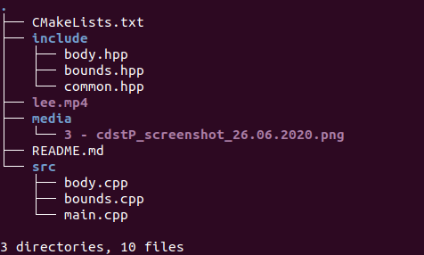

# Badminton Player Tracker

**Overview**

This project is aimed toward tracking players movements on a badminton court. It uses the OpenCV framework and standard, readily available footage for doing this. It will be able to track player position on the court and calculate metrics such velocity, acceleration, heat maps. Future plans involve combining this with OpenPose to get a more refined set of metrics.

**Installation and Running Instruction**

1. Clone the repo
   1. `git clone https://gitlab.com/kyle_c/badminton_player_tracker`
   2. `cd badminton_player_tracker`
2. Create a build directory
   1. `mkdir build && cd build`
3. run cmake and then make
   1. `cmake ..`
   2. `make`
4. `./Capstone --video=../lee.mp4`

Requirements include OpenCV version 3.4 or greater as well as Cmake.

Different videos can be used. Ensure that they are in .mp4 format and that the file name is changed accordingly - line 66.

**Directory Structure**

**Expected Output**

Right now functionality is limited. The players can be selected by the user and will be tracked over the length of the video. From there, several masks are applied to filter out the court and then to filter out the court lines and to determine the lines. A mapping is generated from the image frame to real world frame and then a simple position and velocity measuring system is implemented.

**Rubric attempts**

1. The project demonstrates an understanding of C++ functions and control structures.
   1. Code broken down into function and runs sequentially for the most part
   2. See main.cpp
2. The project reads data from a file and process the data, or the program writes data to a file.
   1. Reads from an input
   2. See `main.cpp lines 169`
3. The project accepts user input and processes the input.
   1. Takes in a user defined video file path and tracker type
      2.See `main.cpp lines 71 onwards`
4. The project uses Object Oriented Programming techniques.
   1. Code includes a body class
   2. See `body.hpp`
5. Classes use appropriate access specifiers for class members.
   1. Private and public used for encapsulation
   2. See `body.hpp`
6. Classes abstract implementation details from their interfaces.
   1. See `body.hpp` member functions and inline documentation
7. Classes encapsulate behavior
   1. See `body.hpp`
8. The project makes use of references in function declarations
   1. See any `bounds.cpp` functions

Since this is a work in progress, more will be ticked off the list in time.
